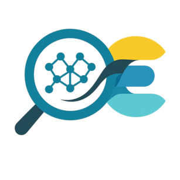

# Smart Elastic Search



> **A natural language to Elasticsearch DSL translation system powered by Azure OpenAI. This project enables users to perform semantic search over structured Elasticsearch indices using natural language queries. The solution automatically converts human-readable queries into DSL and retrieves the most relevant results.**

---

## 🚀 Features

* 🔎 Natural language to Elasticsearch DSL translation
* 🧠 Azure OpenAI GPT (via `openai` Python SDK)
* 📄 Summarization of search results using LLM
* 📊 Aggregations and rollups (e.g., counts, top N)
* 📦 CSV ingestion with an Elasticsearch ingest pipeline
* 🧪 Fully containerized using Docker Compose
* 💬 Prompt engineering with few-shot examples for DSL generation

---

## 🧠 Architecture Diagram


---
## 📁 Project Structure

```bash
elastic_semantic_search/
├── app/                    # Core app logic (ES, LLM, prompts, validation)
│   ├── es.py
│   ├── llm.py
│   ├── prompts.py
│   ├── schema.py
│   ├── telemetry.py
│   └── validators.py
│
├── es/                    # Elasticsearch configuration
│   ├── create_index.http
│   ├── mapping.json
│   └── pipeline_loc_split.json
│
├── data/                  # Input CSV data
│   └── data.csv
│
├── diagrams/              # Architecture and data flow diagrams
│   └── flow_diagram.svg
│
├── ingest/                # Ingestion pipeline
│   ├── __init__.py
│   └── bulk_load.py
│
├── scripts/               # Standalone Elasticsearch scripts
│   ├── __init__.py
│   ├── create_index.py
│   ├── insert_data.py
│   └── search_examples.py
│
├── main.py                # FastAPI entrypoint
├── compose.yml            # Docker Compose setup
├── pyproject.toml         # UV dependency management
├── .python-version
├── .gitignore
└── uv.lock
```

---

## 📦 Installation

### 1. Clone the repository

```bash
git clone https://github.com/your-username/elastic_semantic_search.git
cd elastic_semantic_search
```

### 2. Start Elasticsearch & Kibana

```bash
docker compose up -d
```

Verify:

* [http://localhost:9200](http://localhost:9200) → Elasticsearch
* [http://localhost:5601](http://localhost:5601) → Kibana

### 3. Install Python dependencies using `uv`

   - Initialize environment (if not already done):

     ```uv init```
   - Install dependencies (defined in pyproject.toml):
  
     ```uv sync```

### 4. Activate the virtual environment

   - Using `uv`:

     ```uv shell```
   - Or activate .venv manually::
     ```bash
     source .venv/bin/activate      # Linux/macOS
     .venv\Scripts\activate         # Windows
     ```

### 5. Set environment variables in `.env` file

```env
AZURE_OPENAI_API_KEY=your_key
AZURE_OPENAI_ENDPOINT=https://your-resource.openai.azure.com
AZURE_OPENAI_API_VERSION=2023-05-15
AZURE_OPENAI_COMPLETION_DEPLOYMENT=gpt-4o-mini

ES_URL=http://localhost:9200
ES_INDEX=people-index
MAX_SIZE=100
MODEL_DSL=gpt-4o-mini
MODEL_SUMMARY=gpt-4o-mini
```

---

## ⚙️ Usage Instructions

### 1. Create index and pipeline

```bash
# Using HTTP
curl -XPUT localhost:9200/people-index -H "Content-Type: application/json" -d @es/mapping.json
curl -XPUT localhost:9200/_ingest/pipeline/people_loc_split -H "Content-Type: application/json" -d @es/pipeline_loc_split.json

# OR use HTTP client like REST Client VSCode extension with create_index.http
```

### 2. Ingest data

```bash
python ingest/bulk_load.py --csv data/data.csv --index people-index --pipeline people_loc_split
```

### 3. Run the FastAPI server

```bash
uvicorn main:app --reload --port 8080
```

### 4. Query Example (via curl or Postman)

```bash
curl -XPOST http://localhost:8080/search \
  -H 'Content-Type: application/json' \
  -d '{"query": "People in Singapore who joined a cybersecurity training", "size": 5, "summarize": true}'
```

---

## 🔁 Data Ingestion Sequence Diagram


---

## 🖥️ Inference Sequence Diagram


---

## 🧪 Testing Queries

| Natural Language Query                       | Output                               |
| -------------------------------------------- |--------------------------------------|
| "Top 5 locations for cybersecurity training" | Aggregation on `Locations `          |
| "Count people per team"                      | Aggregation on `Families `           |
| "People in Tokyo who joined a workshop"      | Match query on `Locations`, `Events` |
| "List all those who live in Vietnam"         | Partial match on `Locations`         |

---

## 🧠 Powered By

* **Azure OpenAI Service** (GPT-4o-mini)
* **FastAPI** for RESTful API
* **Elasticsearch** as search backend
* **Kibana** for visualization
* **Pandas** for CSV ingestion

---

## 📜 License

MIT License. See [LICENSE](LICENSE) for details.
